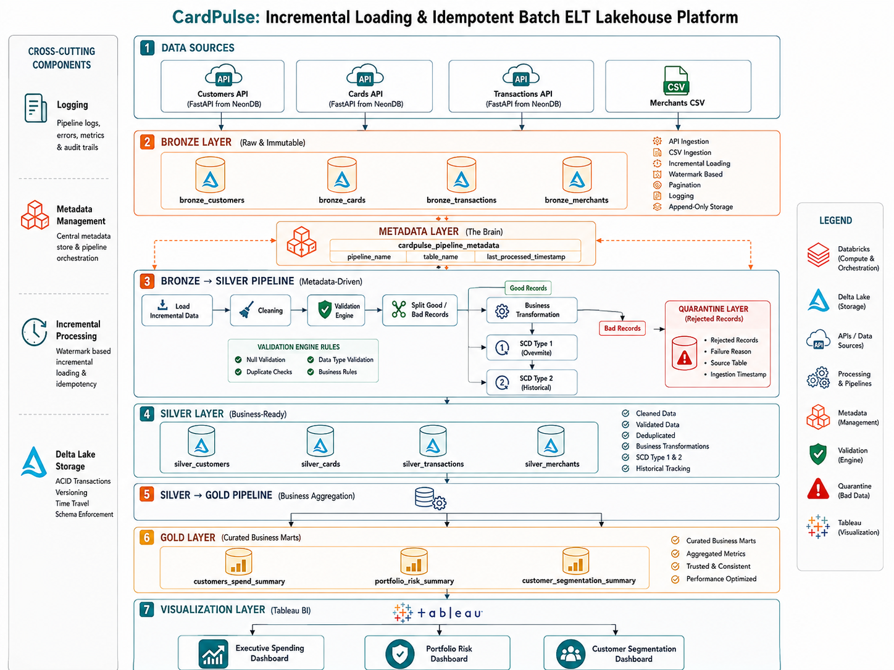

# CardPulse: Credit Card Analytics Lakehouse

CardPulse is an end-to-end batch ELT platform for a Indian credit card business, built on **Databricks, PySpark, and Delta Lake**. It ingests customers, cards, merchants, and transactions from a REST API, PostgreSQL database, and a CSV file, processes them through a **Bronze → Silver → Gold** architecture, and produces business-ready datasets for Tableau.

The focus isn't just moving data — it's making the pipeline **incremental, idempotant, repeatable, validated, and able to track historical change**, the questions that come up once a pipeline has to run more than once.

---

## 🏗️ Architecture



```text
Customers  (PostgreSQL) ──┐
Cards      (PostgreSQL) ──┤
Transactions (REST API) ──┼──▶  Bronze  ──▶  Silver  ──▶  Gold  ──▶  Tableau
Merchants  (CSV)        ──┘
```

**Pipeline flow, end to end:**

```text
Sources → Ingestion → Bronze → Cleaning + Dedup → Validation ──┬──▶ Quarantine
                                                                └──▶ Silver → Business Aggregations → Gold → Tableau
```

Orchestrated as: `Configuration → Ingest→Bronze → Bronze→Silver → Silver→Gold`

### 🥉 Bronze
Raw ingestion, minimal transformation.
- Full load on the first run; **incremental loading via `updated_at` + a metadata watermark table** after that
- API pagination using `limit`/`offset`
- Early exit when no new records are found

### 🥈 Silver
Cleaned, standardized, validated, analytics-ready.
- Deduplication, type conversion, standardization and other cleaning practices
- Rule-based data quality validation via a shared, reusable validation function
- Failed records routed to **quarantine with a logged failure reason** — never silently dropped
- **SCD Type 1 & Type 2** for customer history

### 🥇 Gold
Business-facing datasets:
- `customers_spend_summary` → how customers are spending
- `portfolio_risk_summary` → credit exposure and risk
- `customer_segmentation_summary` → who the customers are and how they behave
- The dashboards are available at Tableau Public: _https://public.tableau.com/views/cardplus_dashboards/CardPulseCustomerIntelligenceSegmentation?:language=en-GB&:sid=&:redirect=auth&:display_count=n&:origin=viz_share_link_
---

## ⚙️ Key Engineering Decisions

**Metadata-driven incremental loading** — each pipeline/table tracks its own `last_processed_timestamp`, so re-running the pipeline never reprocesses old data:

```text
Metadata → last_processed_timestamp → API updated_after → New Records → Processing → Update Metadata
```

**Paginated API ingestion** — large datasets are pulled in batches (`limit`/`offset`), not in one request.

**Data quality & quarantine** — invalid records are separated out and stored with a reason, not silently discarded.

**Selective SCD Type 1 / Type 2** — customer changes are classified by what actually changed:
- **Type 1** → update the current record in place (e.g. a card count)
- **Type 2** → close the current version, open a new historical one (e.g. a risk grade change)

**Merge Based Idempotancy** — Apart from SCD Type 1 & 2 in Customers, the Cards and Transactions uses Merge based idempotancy (which supports Type 1 SCD)

This avoids creating unnecessary customer history for every trivial field update.

---

## 📊 Data Scale

| Dataset | Records |
|---|---|
| Merchants | 800 |
| Customers | 17,000 |
| Cards | 31,690 |
| Transactions | 537,281 |
| Customer Spend Summary | 90,751 |
| Portfolio Risk Summary | 17,000 |
| Customer Segmentation Summary | 17,000 |

---

## 📈 Dashboards

Three Tableau dashboards, built from the Gold layer:
- **Executive Spending Intelligence**
- **Portfolio Risk Command Center**
- **Customer Intelligence & Segmentation**

Dashboard files and previews are in [`dashboards/`](dashboards/).

---

## 📁 Repository Structure

```text
CardPulse/
│
├── architecture/     # Architecture & orchestration diagrams
├── dashboards/       # Tableau workbook & previews
├── data/             # Source & Gold visualization data
├── notebooks/        # Databricks pipeline notebooks
└── src/              # Pipeline Code in .py, If notebooks failes to open
```

## 🧰 Tech Stack

Databricks · PySpark · Delta Lake · Python · PostgreSQL (NeonDB) · FastAPI (REST APIs) · Tableau

## 🎯 Project Focus

Metadata-driven processing · Incremental Loading & Ingestion · Merge Based Idempotancy · Medallion Architecture · Delta Lake · Data Quality & Quarantine · SCD Type 1/2 · Logging at each stage · Pipeline Orchestration · Business-ready Gold datasets
